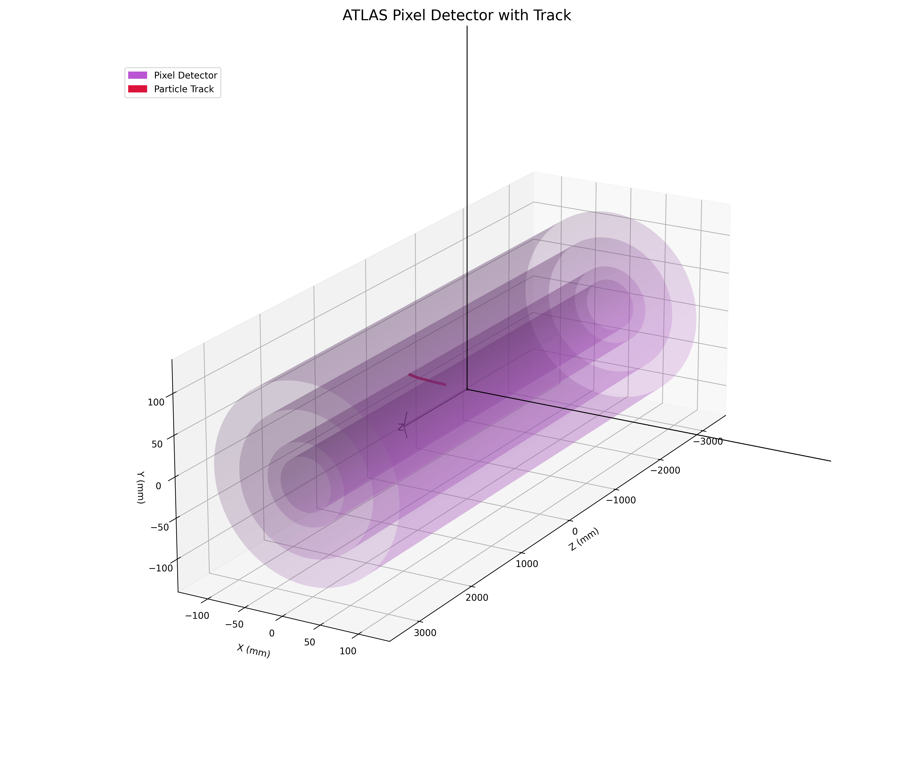

# Kalman Filter Track Reconstruction

This project aims to simulate charged particle track reconstruction as it happens in ATLAS.

## Introduction

The Inner detectors at ATLAS and CMS aim to reconstruct charged particle trajectories using hits on pixel detectors and matching those hits using a combinatorial Kalman filter to reconstruct the track paramaters \cite{trackseeding}. A track is defined by 5 parameters, namely: The transverse and longitudinal distances of closest approach to a reference point(d0 and z0), the polar and azimuthal angle  of the momentum vector at the reference point, and the charge to momentum ratio (q/p)

## Implementation

For this project, we aim to write a python package that recreates a toy model of ATLAS track reconstruction. We will use numpy to create a 3d meshgrid of cylindrical coordinates to act as our detector
model, and simulate charged particle trajectories that register hits on them. Then we will use a Kalman filter algorithm that we will either write ourselves, or use a package, to reconstruct the tracks using the data from hits. We will use object oriented programming design in python to create classes for tracks, the detector, and for hits on the detector. We will use matplotlib to help visualize our tracks and see how the reconstructed tracks from the Kalman filter lines up with the original track.
 ## Pixel Detector Track Simulation

 This project involves reconstructing the passage of charged particles through the pixel detector. To make this project more manageable, we have divided it into 4 tasks. On the one hand, we simulated the ATLAS detector with an axis of x, y, z coordinates and simulated the behavior of a charged particle subjected to a magnetic field. On the other, we linked the particle's impact points to the 4 pixel layers and created a .png file.

